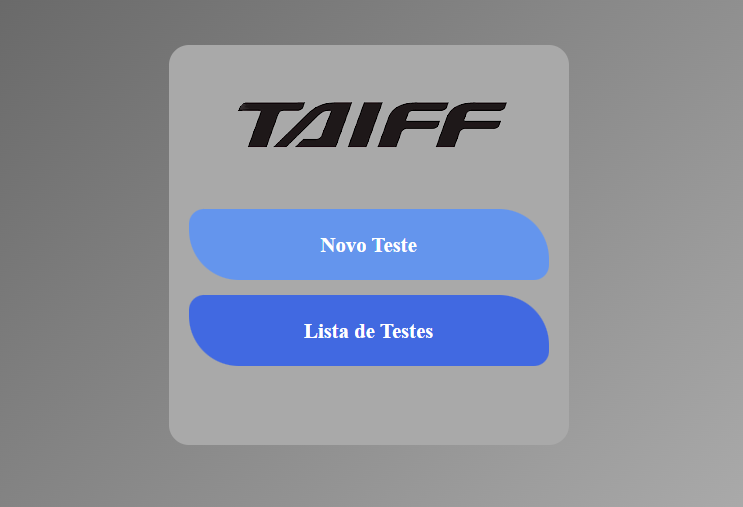
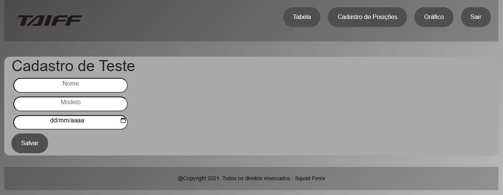
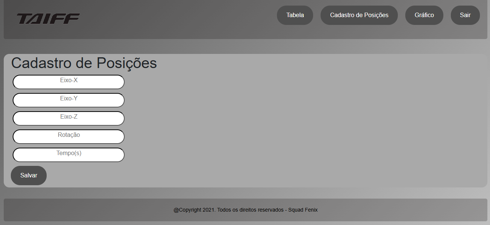
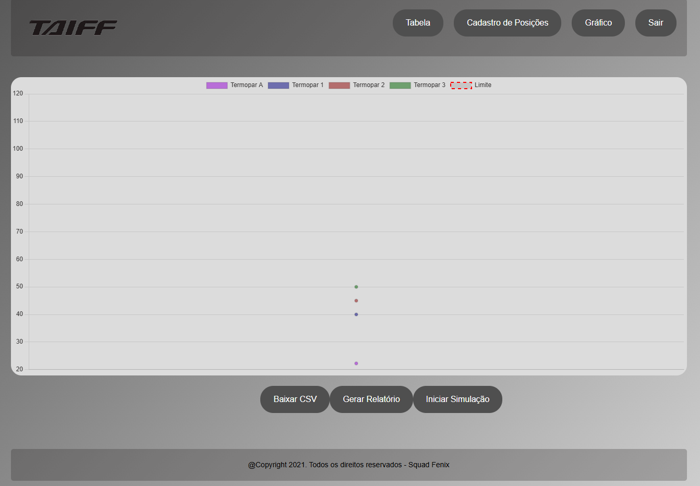
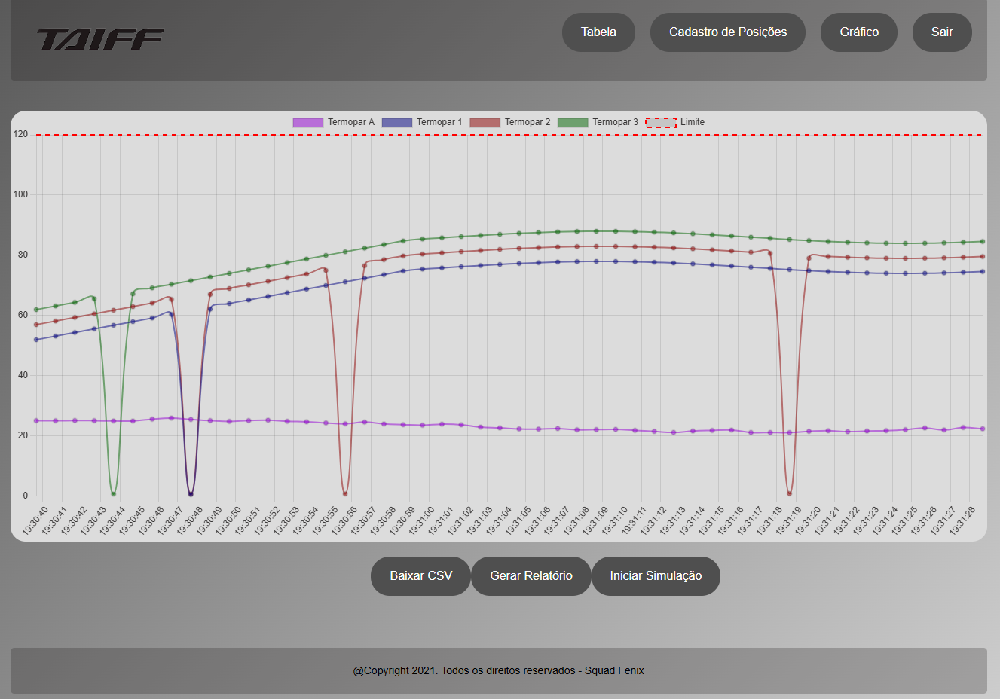
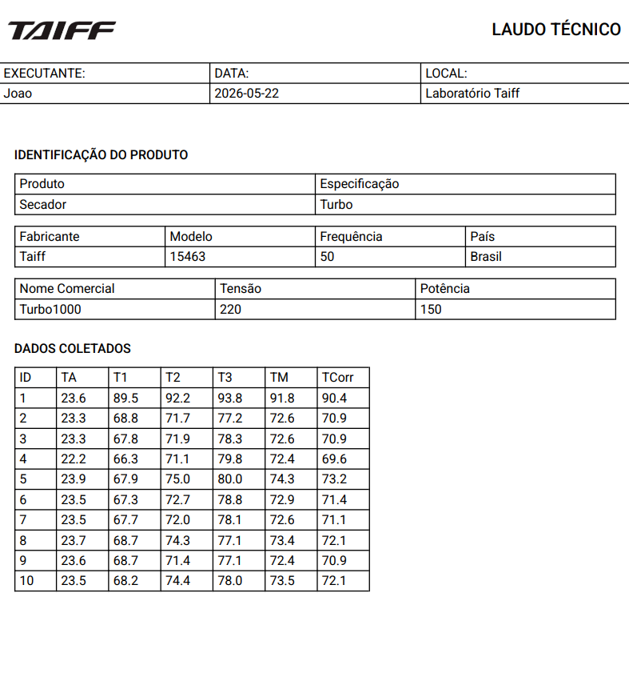
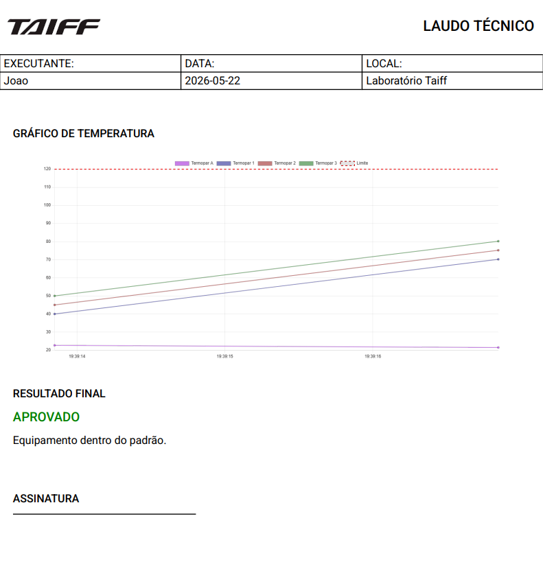
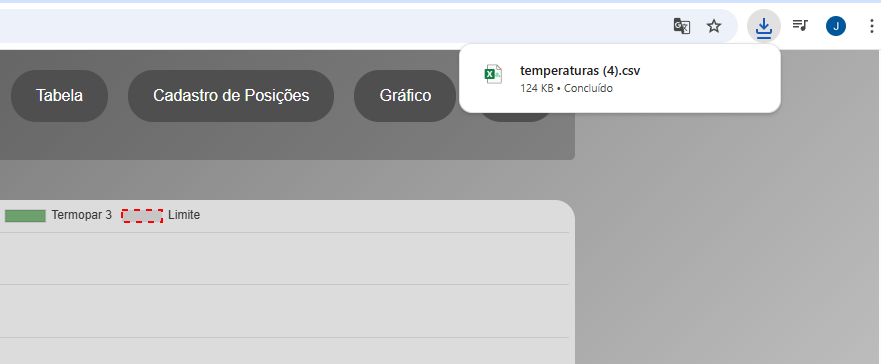

# 🔥 Sistema de Monitoramento de Temperatura em Tempo Real


Projeto full stack desenvolvido para monitoramento e simulação de testes térmicos industriais em tempo real, com visualização gráfica dinâmica, geração de relatórios e exportação de dados.
---

## 📌 Sobre o projeto

Este sistema foi desenvolvido com o objetivo de simular testes de temperatura (como em secadores de cabelo), permitindo:

* 📊 Visualização em gráfico em tempo real
* 🌡️ Monitoramento de múltiplos sensores (T1, T2, T3 e ambiente)
* ⚙️ Simulação de aquecimento, estabilização e resfriamento
* 📄 Geração de relatórios
* 📥 Exportação de dados em CSV

---

## 🧠 Funcionalidades

* ✔️ Stream de dados simulados em tempo real
* ✔️ Gráfico dinâmico com atualização a cada segundo
* ✔️ Controle de início/parada da simulação
* ✔️ Detecção de falhas (valores zerados)
* ✔️ Geração de imagem do gráfico para relatório
* ✔️ Backend com API REST
* ✔️ Integração completa entre frontend e backend

---

## 🛠️ Tecnologias utilizadas

### 🔜 Backend

* Java
* Spring Boot
* Spring Data JPA
* Hibernate
* Banco de dados (H2 ou MySQL)

### 🔜 Frontend

* React.js
* Chart.js
* Axios
* React Router

---

## 📡 Endpoints da API

| Método | Endpoint                        | Descrição                               |
| ------ | ------------------------------- | --------------------------------------- |
| POST   | `/temperatura`                  | Salva uma nova temperatura              |
| GET    | `/temperatura/ultima`           | Retorna a última temperatura registrada |
| POST   | `/temperatura/gerar-lote`       | Gera temperaturas simuladas             |
| POST   | `/temperatura/stream-simulacao` | Inicia simulação em tempo real          |
| POST   | `/temperatura/parar`            | Para a simulação                        |
| POST   | `/zeropeca`                     | Cadastra a posição inicial do teste     |
| POST   | `/gravarteste`                  | Grava as informações do teste           |
| POST   | `/gravarposicao`                | Cadastra a proximas posições            |
| GET    | `/medias`                       | Retorna as médias das temperaturas      |
| GET    | `/testes`                       | Retorna os testes já cadastrados        |
---

## 📊 Como funciona a simulação

A simulação segue 3 fases:

1. 🔥 Aquecimento (subida gradual)
2. ⚖️ Estabilização (com pequenas oscilações)
3. ❄️ Resfriamento (queda progressiva)
---

## 🚀 Como rodar o projeto

### 🔧 Backend

```bash
cd squadFenix-backend
./mvnw spring-boot:run
```

ou

```bash
mvn spring-boot:run
```

Servidor roda em:
👉http://localhost:8080

---

###  Frontend

```bash
cd squadFenix-frontend
npm install
npm start
```

Aplicação roda em:
👉http://localhost:3000

---

## ▶️ Como usar

### 1. Clique em Novo Teste


### 2. Cadastre a posição inicial do secador


### 3. Cadastre o produto e a data do teste


### 4. Cadastre as posições do teste


### 5. Vá até a tela do gráfico


### 6. Clique em Iniciar Simulação

### 7. Acompanhe o gráfico em tempo real


### 8. Gere o relatório




### 9. Baixe os dados CSV


---

## Possíveis melhorias futuras

* 📄 Geração de PDF automática
* 🔔 Alertas quando ultrapassar limites
* 📡 WebSocket ao invés de polling
* 🧪 Testes automatizados
* ☁️ Deploy em nuvem (AWS / Railway)

---

## 👨‍💻 Autor

Desenvolvido por **Squad Fênix**

### Integrantes
- João Vitor Albuquerque
- William
- Valcelio
- Edy
- Luiz

---

## ⭐ Considerações

Este projeto demonstra:

* Integração full stack
* Manipulação de dados em tempo real
* Boas práticas com API REST
* Uso de gráficos dinâmicos
* Simulação de cenários reais de sistema

---